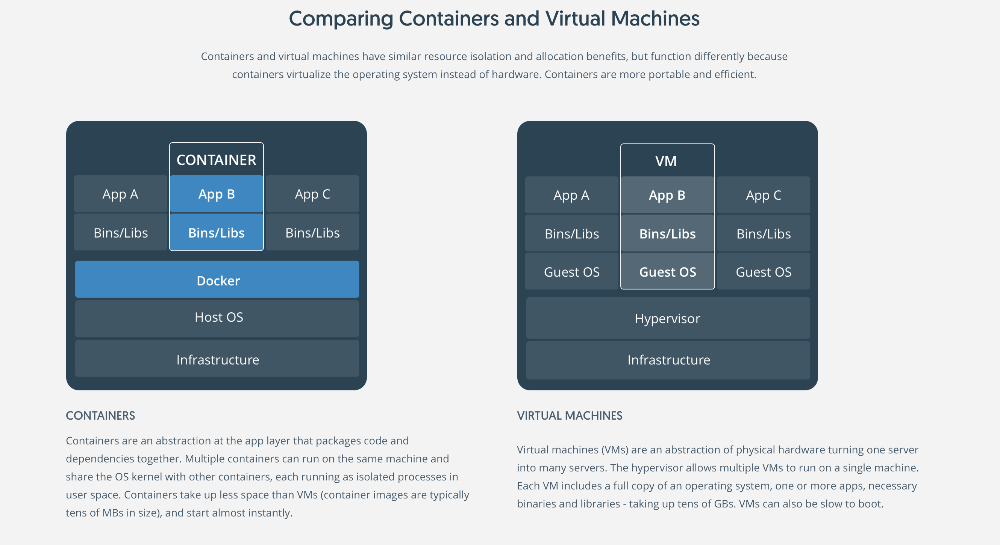

# Docker Container Stuff

### What is Container?
   Containers offer a logical packaging mechanism in which applications can be abstracted from the environment in which they actually run. This decoupling allows container-based applications to be deployed easily and consistently, regardless of whether the target environment is a private data center, the public cloud, or even a developer’s personal laptop. Containerization provides a clean separation of concerns, as developers focus on their application logic and dependencies, while IT operations teams can focus on deployment and management without bothering with application details such as specific software versions and configurations specific to the app.

For those coming from virtualized environments, containers are often compared with virtual machines (VMs). You might already be familiar with VMs: a guest operating system such as Linux or Windows runs on top of a host operating system with virtualized access to the underlying hardware. Like virtual machines, containers allow you to package your application together with libraries and other dependencies, providing isolated environments for running your software services. As you’ll see below however, the similarities end here as containers offer a far more lightweight unit for developers and IT Ops teams to work with, carrying a myriad of benefits.

### Comparing Containers and Virtual Machines



### Why Container?

   Instead of virtualizing the hardware stack as with the virtual machines approach, containers virtualize at the operating system level, with multiple containers running atop the OS kernel directly. This means that containers are far more lightweight: they share the OS kernel, start much faster, and use a fraction of the memory compared to booting an entire OS.
   
### What is Docker?

   Docker is an open platform for developing, shipping, and running applications. Docker enables you to separate your applications from your infrastructure so you can deliver software quickly. With Docker, you can manage your infrastructure in the same ways you manage your applications. By taking advantage of Docker’s methodologies for shipping, testing, and deploying code quickly, you can significantly reduce the delay between writing code and running it in production.

### The Docker platform

   Docker provides the ability to package and run an application in a loosely isolated environment called a container. The isolation and security allow you to run many containers simultaneously on a given host. Containers are lightweight because they don’t need the extra load of a hypervisor, but run directly within the host machine’s kernel. This means you can run more containers on a given hardware combination than if you were using virtual machines. You can even run Docker containers within host machines that are actually virtual machines!
   
   Docker provides tooling and a platform to manage the lifecycle of your containers:

   * Develop your application and its supporting components using containers.
   * The container becomes the unit for distributing and testing your application.
   * When you’re ready, deploy your application into your production environment, as a container or an orchestrated service. This works the same whether your production environment is a local data center, a cloud provider, or a hybrid of the two.
   
# Docker Components:
 
 **Docker Engine**
    
  Docker Engine is a client-server application with these major components:
  
   * A server which is a type of long-running program called a daemon process (the dockerd command).
   * A REST API which specifies interfaces that programs can use to talk to the daemon and instruct it what to do.
   * A command line interface (CLI) client (the docker command).
   
   
   
  The CLI uses the Docker REST API to control or interact with the Docker daemon through scripting or direct CLI commands. Many other Docker applications use the underlying API and CLI.

  The daemon creates and manages Docker objects, such as images, containers, networks, and volumes.
  
  **What can I use Docker for?**
  
  * Fast, consistent delivery of your applications
  * Responsive deployment and scaling
  * Running more workloads on the same hardware
  
  **Docker architecture**
  
  Docker uses a client-server architecture. The Docker client talks to the Docker daemon, which does the heavy lifting of building, running, and distributing your Docker containers. The Docker client and daemon can run on the same system, or you can connect a Docker client to a remote Docker daemon. The Docker client and daemon communicate using a REST API, over UNIX sockets or a network interface.
  
  
  
  the below diagram shows how docker works,
  
  
  
  **The Docker daemon**
  
   The Docker daemon (dockerd) listens for Docker API requests and manages Docker objects such as images, containers, networks, and volumes. A daemon can also communicate with other daemons to manage Docker services.
   
  **The Docker client**
  
  The Docker client (docker) is the primary way that many Docker users interact with Docker. When you use commands such as docker run, the client sends these commands to dockerd, which carries them out. The docker command uses the Docker API. The Docker client can communicate with more than one daemon.
  
  **Docker registries**
  
  A Docker registry stores Docker images. Docker Hub and Docker Cloud are public registries that anyone can use, and Docker is configured to look for images on Docker Hub by default. You can even run your own private registry. If you use Docker Datacenter (DDC), it includes Docker Trusted Registry (DTR).

  When you use the docker pull or docker run commands, the required images are pulled from your configured registry. When you use the docker push command, your image is pushed to your configured registry.
  
# Docker Objects
 
  When you use Docker, you are creating and using images, containers, networks, volumes, plugins, and other objects. This section is a brief overview of some of those objects.
  
 **IMAGES**
 
   An image is a read-only template with instructions for creating a Docker container. Often, an image is based on another image, with some additional customization. For example, you may build an image which is based on the ubuntu image, but installs the Apache web server and your application, as well as the configuration details needed to make your application run.

  You might create your own images or you might only use those created by others and published in a registry. To build your own image, you create a Dockerfile with a simple syntax for defining the steps needed to create the image and run it. Each instruction in a Dockerfile creates a layer in the image. When you change the Dockerfile and rebuild the image, only those layers which have changed are rebuilt. This is part of what makes images so lightweight, small, and fast, when compared to other virtualization technologies.

 **CONTAINERS**
 
  A container is a runnable instance of an image. You can create, start, stop, move, or delete a container using the Docker API or CLI. You can connect a container to one or more networks, attach storage to it, or even create a new image based on its current state.

  By default, a container is relatively well isolated from other containers and its host machine. You can control how isolated a container’s network, storage, or other underlying subsystems are from other containers or from the host machine.

  A container is defined by its image as well as any configuration options you provide to it when you create or start it. When a container is removed, any changes to its state that are not stored in persistent storage disappear.
  
  * Example `docker run` command
  
   The following command runs an ubuntu container, attaches interactively to your local command-line session, and runs /bin/bash.
   
   ```
   $ docker run -i -t ubuntu /bin/bash
   ```
   
   When you run this command, the following happens (assuming you are using the default registry configuration):

   * If you do not have the `ubuntu` image locally, Docker pulls it from your configured registry, as though you had run `docker pull ubuntu` manually.
   * Docker creates a new container, as though you had run a `docker container create` command manually.
   * Docker allocates a read-write filesystem to the container, as its final layer. This allows a running container to create or modify files and directories in its local filesystem.
   * Docker creates a network interface to connect the container to the default network, since you did not specify any networking options. This includes assigning an IP address to the container. By default, containers can connect to external networks using the host machine’s network connection.
   * Docker starts the container and executes /bin/bash. Because the container is run interactively and attached to your terminal (due to the -i and -t flags), you can provide input using your keyboard and output is logged to your terminal.
   * When you type exit to terminate the /bin/bash command, the container stops but is not removed. You can start it again or remove it.
   
# The underlying technology
  
   Docker is written in Go and takes advantage of several features of the Linux kernel to deliver its functionality.
   
   **Namespaces**
   
   Docker uses a technology called namespaces to provide the isolated workspace called the container. When you run a container, Docker creates a set of namespaces for that container.

   These namespaces provide a layer of isolation. Each aspect of a container runs in a separate namespace and its access is limited to that namespace.
   
   Docker Engine uses namespaces such as the following on Linux:

   * The pid namespace: Process isolation (PID: Process ID).
   * The net namespace: Managing network interfaces (NET: Networking).
   * The ipc namespace: Managing access to IPC resources (IPC: InterProcess Communication).
   * The mnt namespace: Managing filesystem mount points (MNT: Mount).
   * The uts namespace: Isolating kernel and version identifiers. (UTS: Unix Timesharing System).
   
   **Control groups**
   
   Docker Engine on Linux also relies on another technology called control groups (cgroups). A cgroup limits an application to a specific set of resources. Control groups allow Docker Engine to share available hardware resources to containers and optionally enforce limits and constraints. For example, you can limit the memory available to a specific container.
   
   **Union file systems**
   
   Union file systems, or UnionFS, are file systems that operate by creating layers, making them very lightweight and fast. Docker Engine uses UnionFS to provide the building blocks for containers. Docker Engine can use multiple UnionFS variants, including AUFS, btrfs, vfs, and DeviceMapper.
   
   **Container format**
   
   Docker Engine combines the namespaces, control groups, and UnionFS into a wrapper called a container format. The default container format is libcontainer. In the future, Docker may support other container formats by integrating with technologies such as BSD Jails or Solaris Zones.
   

# Docker installation

Follow this Document [DockerInstallation](setup.md)

**Docker Commands**

After successfull Installation Docker needs root access to run the docker commands. There are couple of ways to give access to other users. Asume the other username name is Alice. From Alice user if you run the `docker run` command,

`$ docker run -it ubuntu /bin/bash`

It will fail as permission denied. Now add the Alice User to docker group, Now it will have the permission to run the docker commands. The other way is adding the user to sudoers file. i.e `/etc/sudoers` or `visudo` file.

```
cat /etc/group
sudo gpasswd -a Alice docker
```
Now run the docker run command,
```
$ docker run -it ubuntu /bin/bash
```
To check the Docker Info
```
$ docker info
```
To check the Docker version, the docker version list both client and server version, The client to server communication happens via rest(http) API. More info on the above diagram.

```
$ docker version
```
The Docker application has been installed on the Ubuntu Host machine. Even though host machine is Debian based if I run the docker centos, It will share the same kernal.

On the host machine
```
$ uname -a
```
Now, run inside the container.

```
Inside the container
$ docker run it centos /bin/bash
uname -a 
```
To check the Number of running containers, run the below command,
```
$ docker ps
$ docker ps -a ( will list both all running and non-running containers that has been ran on this host machine)
```

To start the container and attach it to the container, based on the `docker ps -a` command,
```
$ docker start <containerid>
$ docker attach <container id>
```

### Docker Images  
 
 To pull the images from repositories, and to run the pulled images, while pulling the will see the number of different id, those are layers. Note: Docker images are composed of multiple layers.
 
 ```
 $ docker pull fedora # will pull the docker images from repo,
 $ docker images 
 ```
 To run the pulled images, Launch container (i = interactive, -t = attach to terminal) This will launch the container, but not keep it running once we exit
 ```
 $ docker run -it fedora /bin/bash
 ```
 By default, docker will pull the latest tag images. To pull the specific version
 ```
 $ docker pull ubuntu (would be latest)
 $ docker pull ubuntu:trusty (Or any tag listed in dockerhub)
 ```
 "Container Layers build the docker image".
 
 And to fetch all the fedora images,
 ```
 $ docker pull -a fedora
 $ docker images fedora
 ```
 All the pulled images are are localy stored under the `/var/lib/docker/aufs/` directory on the host machine.
 
 - Locations
    - **Where Container Details are Located**
        - `var/lib/docker` is where all `images/containers` are stored
        - cd `var/lib/docker/containers/<hex>`
    - **Where Images are Located**
        - ls `/var/lib/docker/image/aufs/imagedb/content/sha256`
    
    **Layered images**

      Docker is a multiple layered filesystem. A Union Mount filesystem. Union mount allows multiple layers. All the below layers are only readable. Only the top layer is writeable/readable. And each layer have unique id. The below layer is called rootfs(layer1).
  
  


### Docker containers
   Containers are launced from images. To launch a container `docker run` command.
   ```
   $ docker run -it ubuntu /bin/bash
   ```
   And to detach from the container itself, Inside the container 
   ```
   ctrl + p + q (Inside the container) 
   ```
   
   Keep the container running in Background
   ```
   $ docker run -itd ubuntu:xenial /bin/bash
   ```
   
### Repositories and Registry
   There are multiple registeries.Mostly Private and Public registries. Public registries such as dockerhub,quay.io. Under reach registries we will have multiple repositories. And Under each repos, will have multiple images.
   
   


### Docker Commands:

 **Docker copying**
 
 Now, run a some container and create a file inside the container,
 ```
 $ docker images
 $ docker run -it --name=dockersave ubuntu /bin/bash
 $ apt-get install vim
 $ vim file1
   "added some content"
 $ exit
 ```
 Now even after exiting the container, `docker ps` will only be listing running container, run `docker ps -a` to see all the non-running container. And our container `dockersave` will be listing and all our written files will be still present in that contianer. To commit that container.

  ```
   $ docker ps -a
   $ docker commit  <id> apple
   $ docker images
   $ docker history apple
  ```
  After the commit, we will see the `dockersave` container as `apple` in the `docker images` output. The `docker history apply` will list all latest command ran on that `apple` container.
  
  To save the container. I've saved as tar file. Now couple of ways we can give this container to others. One is by sending this tar file. the other is by pushing it to docker registry.
  ```
   $ docker save -o /tmp/apple.tar apple
   $ ls -lh /tmp/apple.tar
   $ tar -tf /tmp/apple.tar
   ```
   
   On other machine, 
   ```
   $ docker load -i /tmp/apple.tar
   $ docker run -it apple /bin/bash
   $ cat file1
   $ docker history apple
   ```
   Now, the `apple` container has been loaded on the other machine and all our files are present. 
   
**NOTE:** Images are build time contructs and containers are runtime contructs.
  
### Docker CPU, Memory
   It is always recomemded to run one process per containers. Even though we can run multiple process inside the container. Now running the ping process on the ubuntu container, Once the count reaches 30, The ping process will be finished and the contianer exits. Meanwhile I'm running the ping process as detached mode.
   
   ```
   $ docker run -d ubuntu /bin/bash -c "ping 8.8.8.8 -c 30"
   $ docker ps
   $ docker top
   $ docker ps
   ```
   After 30 ping count finished, the ping process is closed. And immdiately container will be exited. to see the exited container.
   ```
   $ docker ps -a
   ```
   
   To allocate the No. of cpu shares to the particular container.
   
   ```
   $ docker run --cpu-shares=256 -it ubuntu /bin/bash
   ```
   More info [DOCKER CPU](https://goldmann.pl/blog/2014/09/11/resource-management-in-docker/#_cpu)
   
   To allocate Memory to the container.
   ```
   $ docker run memory=1g -it ubuntu /bin/bash
   ``` 
 Now running the docker container with infinite ping process count,
 ```
   $ docker run -d ubuntu:14.01 /bin/bash -c "ping 8.8.8.8"
   $ docker ps
   $ docker inspect <id>
   $ docker attach <name>
   ```
   The `docker inspect` command will list everything realated to the running container details,such as CPU,MEMORY,NETWORK,DISK,etc...
   

### Container Management
   * container management
   * container configuration
   * Inside running containers
   * Different ways to get shell access to the running conatainer.

  **Contianer Management**
  
   Inside the container, everything operates based on the namespace,cgroups. A namespace is like sandbox, a seprate isolation which will not impact to the host machine, or other containers inside the host machine. And there are multiple namespaces,
    
   To start the container,
   ```
   $ docker ps -a
   $ docker start <contianer id> or <container name>
   ```
   To stop the running container,
   ```
   $ docker stop <container id> or <contianer name>
   ```
   To restart the contianer,
   ```
   $ docker restart <container id>
   ```
  
  The docker stop will send the `SIGTERM` signal to the contianer process PID1, which will gracefully shutdown the container.
  
  To kill the container,
  ```
  $ kill -l ( to list all the signals)
  $ docker kill -s 9 <container id>
  ```
  The `docker kill` will send the `SIGKILL` to the container process to forcefully shutdown the container.
  ```
  $ docker ps -l
  ```
   will list the last container.
   
 **Container Configuration**
 
  It is always recomemded to run one process per container.
  ```
   $ docker ps 
   $ docker info
   ```
   the `docker info` will all the containers, images and other info such as storage details.
   
   the other ways to see all the containers in the host machine is
   ```
   $ ls -l /var/lib/docker/containers | wc -l
   ```
   
   To remove the running contianer, first stop the contianer,
   ```
   $ docker stop <contianer id>
   $ docker rm <contianer id>
   ```
   
   To remove all the contianer from the `docker ps -a` list. 
   ```
   $ for i in $(docker ps -a | sed 1d | awk '{print $3}'); do echo $i; docker stop $i; docker rm $i; done
   ```
   
   The `docker rm -f` will forcefully remove the container. 

   To remove the images,
   ```
   $ docker images
   $ docker rmi <id>
   ```
  
  Top process of the container,
  
 ```
 $ docker top
 $ docker top <id>
 ```
 
 To see the logs of the container,
 ```
 $ docker logs <id>
 $ docker logs -f <id>
 ```

 **Getting inside the shell of the running container**
 
 First way is,
 ```
 $ docker attach <id>
 ```
 which will attach to the PID1.
 
 Second way is SSH. Which is not recomemded.
 
 Thrid way is using `nsenter` tool. `nsenter` allows uis to enter in to namespaces. And it also required contianer id(`docker inspect`).
 ```
 $ docker inspect <id> | grep pid
 ```
 The nsenter command,where each `-u','-m','-n','-p',` are different namespaces. 
 ```
 $ nsenter -m -u -n -p -i -t <pid> /bin/bash
 ```
 
 Fourth way,
 ```
  $ docker-enter <id>
 ```
 
 Best recomemded way is, and mostly used is.
 ```
  $ docker exec -it <id> /bin/bash
 ```

# DockerFile

  We can write our own images using Dockerfile. Create a directory
  ```
  $ mkdir DockerStuff
  $ cd DockerStuff
  $ Vim Dockerfile
    # write the below content in to the dockerfile without quotes.
    """
      FROM ubuntu:15.04
      MAINTAINER youknowme@gmail.com
      RUN apt-get update
      RUN apt-get install -y nginx
      RUN apt-get install -y golang

      CMD [ "echo 'hello world'"]
    """
    
   $ docker build -t helloworld:0.1 .  #(building the contianer with tag version 0.1 and named as helloworld in the "." current directory)
   $ docker images #(will see the newly created helloworld images with 0.1 tag)
  ```

To see the history,and run the container,
```
$ docker history helloworld:0.1
$ docker run helloworld:0.1 
```

Now Pushing the `helloworld:0.1` container to the docker registry(i.e Dockerhub). Before that create a login on the [DockerHub](https://hub.docker.com/). 

 Now Create a repository, on the dockerhub site.
 
 
 
 After finished creating the repo,
 ```
 $ docker login #(enter the docker hub credentials)
 $ docker images
 $ docker tag <id> prasanna/helloworld:1.0 #(id is local helloworld container id)
 $ docker push prasanna78/helloworld:1.0 #(Pushing to prasanna78/helloworld repo)
 ```

### Deeper in to DockerFile
   * The Build cache
   * DockerFile
   
   For the first time, it will take some time to build the container, Next time it consumes less time when running the same build again. Because each layers adds new unique id(which is SHA). Next time if any command is added to the top of the layer. SHA will check if there is any change on the layers. Only the changed layers will be build on top of the docker container layers.
   
   ```
   $ docker images
   $ cd DockerBuildFiles
   $ docker build -t="v0.1" .
   $ docker build -t="v0.2" .
   ```
   **Images layers**
   
   ```
   $ docker images
   $ docker info
   ```
   Docker file , each line will adds the new layer to the contianer.
   
   
     

###  Dockerfile Directives: USER and RUN

```
docker pull centos:latest
```

*Dockerfile*

FROM must be the first directive

```
# Dockerfile based on the latest CentOS 7 image - non-privileged user entry
FROM centos:latest
MAINTAINER imboyus@gmail.com

RUN useradd -ms /bin/bash user
USER user
```

docker build -t centos7/nonroot:v1 .
docker run -it centos centos7/nonroot:v1 /bin/bash

_note: When rebuilding an image, it only changes additions and keeps the cache from already existing command builds_

Since a user can't login, we login as user:
```
docker ps -a
docker start cocky_boyd
docker exec -u 0 -it cocky_boyd /bin/bash
```

### Dockerfile Directives: RUN Order of Execution

- **Order of Execution**
    - `FROM`
    - `MAINTAINER`
    - `RUN`
        - * _If you make a `USER` AFTER this, everything will run as THAT user_

- **Important**
    - `RUN`: execute at build time, becomes part of the base image.
    - `CMD`: Runs when a container is instantiated, eg: Run an application.

```
docker build -t centos7/config:v1 .
docker run -it centos7/config:v1 /bin/bash
cat /etc/exports.list
```

### Dockerfile Directives: ENV


**When doing updates or installs always do `apt-get update -y` or `yum update -y`**

```
Docker build -t centos7/java8:v1 .      (You'll see red, that's ok)
```

Check the `ENV` is set for Java, though limited to one user
```
docker images
docker run -it centos7/java8:v1 /bin/bash
env
```

Control System-wide variables
```
Dockerfile:
ENV JAVA_BIN /usr/java/jdk1.8.0/jre
```

```
docker run -it centos7/java8:v2 /bin/bash
env     (Now we see JAVA_HOME global)
```

### Dockerfile Directives: CMD vs RUN


- Differences
    - `RUN`: execute at build time, becomes part of the **base image**.
    - `CMD`: Runs when a container is instantiated, or container starts. eg: Run an application. **not part of the build process**, ONE CMD per Dockerfile

```
docker build -t centos7/echo:v1 .
docker images
docker run centos7/echo:v1  ; Should see an echo from the CMD
```

### Dockerfile Directives: ENTRYPOINT


Sets default application used everytime a container is created even if you ask it to do something else.

```
docker build -t centos7/entry:v1 .
docker images

; Test these
docker run centos7/entry:v1
docker run centos7/echo:v1  /bin/bash echo "See me?"      ; Yes (Notice this is /echo)
docker run centos7/entry:v1  /bin/bash echo "See me?"     ; No
docker run centos7/entry:v1                               ; Outputs default CMD
```

- Difference between `ENTRYPOINT` and `CMD`
    - `ENTRYPOINT` - Runs no matter what
    - `CMD` - CAN be overwritten for a command, eg: in an echo example above

### Dockerfile Directives: EXPOSE

- **Commands**
    - `-P` is to run/remap any ports in the container

```
docker build -t centos7/apache:v1 .
docker images

; Run container as daemon so it doesn't exit and think it's done

docker run -d --name apacheweb1 centos7/apache:v1
docker ps
docker inspect apacheweb1 | grep IPAdd
```
__Dont worry about the red GPG keys__

See it all works
```
elinks http://172.17.0.3
docker exec apacheweb1 /bin/cat /var/www/html/index.html
docker ps    (Container still running)
```

No Ports Exposed, so:
```
docker stop apacheweb1

docker run -d --name apacheweb2 -P centos7/apache:v1
docker ps    (no ports exposed still)
docker stop apacheweb2
```

Manually Remap ports **outside** of `Dockerfile`
```
docker run -d --name apacheweb3 -p 8080:80 centos7/apache:v1
docker ps    (ports are exposed)
elinks http://localhost:8080
```

In `Dockerfile`, add:
```
EXPOSE 80
```

Rebuild and check!
```
docker build -t centos7/apache:v1 .
docker run -d --name apacheweb4 -P centos7/apache:v1
docker ps
```


```
FROM ubuntu:15.04
RUN apt-get update
RUN apt-get install -y apache2
RUN apt-get install -y apache2-utils
RUN apt-get install -y vim
RUN apt-get clean
EXPOSE 80
CMD ["apache2ctl","-D","FOREGROUND"]
```

docker build -t="webserver"
docker run -d -p 80:80 webserver
docker stop <id>

#Avoid creating unnessary layers


-> Execform
["command","args1"]


RUN
-> buildtime
-> add layers to images
-> used to install apps


#ENTRYPOINT
ENTRYPOINT ["echo"]
docker build -t="asdad" .
docker run asdad hellp asdasd
docker run -it asdad /bin/bash

ENTRYPOINT ["apache2ctl"]
build it and run

docker run -d -p 80:80 web2 -D FOREGROUND

#ENV
ENV Key=value
ENV var1=prasanna var2=ranganathan

```
FROM ubuntu:15.04
RUN apt-get update && apt-get install -y iputils-ping apache2
ENV var1=ping var2=8.8.8.8
CMD $var1 $var2
```

# Docker Volumes

```
docker run -it -v /test_vol --name=voltainer ubuntu:15.-4 /bin/bash
create afile under /test_vol in the container
docker inspect
```

```
docker run -it -p 5984:5984 -v $(pwd)/data:/usr/local/var/lib/couchdb --name couchdb klaemo/couchdb
curl -X PUT http://192.168.99.100:5984/db
insert a document using curl
curl -X PUT -H "Content-Type: application/json" -d '{"name": "Avengers"}' http://172.28.128.3:5984/db/avengers

docker create -v /usr/local/var/lib/couchdb --name db-data debian:jessie /bin/true
docker ps
docker ps -a
```

 On the first container
 ```
    $ docker run -d -p 5984:5984 -v /usr/local/var/lib/clouchdb --name db1 --volumes-from db-data klaemo/couchdb
 ```

On the second container
  ```
    $ docker run -d -p 5985:5984 -v /usr/local/var/lib/clouchdb --name db2  --volumes-from db-data klaemo/couchdb
  ```


docker run -it --volumes-from=voltainer ubuntu:15.04 /bin/bash

    ### host mount
not very much scalable
      docker run -it -v /data:/data ubuntu:15.04 /bin/bash


Dockerfile
VOLUME /data

docker rm -v <container>
docker stop voltainer
docekr rm -v voltainer


-> unshare tool
unshare -m bash
unshare -n

#memory error
docker run -it --rm -m 100m debian
free -m
cat /sys/fs/cgroup/memory/memory.limit_in_bytes
echo "$((num / 1024 /1024))

 

#  Docker Networking

Libnetwork
before 1.11 - network won't scale
Three pillars of Docker Networking

- CNM(container network Model)
  - DNA of Docker networking
  
- CNM 
   - LibNetwork 
      * Drivers

CNM Vs CNI


CNM -> (sandbox, endpoint, network)
sandbox -> namespace
endpoint->eth0
network -> connected endpoints

Libnetwork
- control plane and management plane

Drivers
- Data plane

- Overlay
- MacVlan
- Bridge
- local

### Native Drivers Vs Remote Drivers

docker network ls
default is bridge
1) docker0 is bridge network
docker network inspect <id>
2) none network
docker run -d -P --net none --name no-network-app ubuntu
docker exec -it no-network-app bin/bash
3) host network
docker run -d -P --net host --name host-network ubuntu
docker exec -it ubuntu /bin/bash
host network is sometimes disadvanges on the same machine

4) User Defined network
is similar to bridge network
docker network create --driver bridge my-network
docker network ls
docker run -d -P --net my-network --name hello ubuntu
docker inspect hello

### Single Host networking
on bridge driver
- bridge network are single host(Vswitch)
```
docker network create -d bridge --subnet 10.0.0.1/24 ps-bridge
docker network inspect ps-bridge
```
on linux
apt-get install bridge-utils
brctl show
docker network ls
ip link show
docker run -dt --name c1 --network ps-bridge alpine sleed 1d
docker run -dt --name c2 --network ps-bridge alpine sleed 1d
docker network inspect ps-bridge
brctl show -> creates two interfaces

docker exec -it c1 sh
ping c2 
every docker hass DNS server when we create a name for the docker
docker run -d --name web1 --network ps-bridge -p 5000:8080 nginx

#Multi-host Overlay Network
-> Swarm mode

#MACVlan
-> every container gets it own Ip and own mac address on linux but on windows mac address will br shared

#IPVlan
-> mostly cloud friendly

#Network Services
service Discovery
Route mesh


## Docker Compose

```
version: "2"
services: 
   kv-store-1:
      image: redis
   kv-store-2:
       image: redis
```

file2:

```
version: '2'
services:
   elasticsearch:
       image: elasticsearch:2.2.1
   kibana:
       image: kibana:4.4.2
       ports:
         - "5601:5601"
       environment:
         - ELASTICSEARCH_URL=http://elasticsearch:9200
       depends_on:
         - elasticsearch
   logstash:
       image: logstash:2.2.2
       command: -e 'input { tcp { port => 5555 } } output { elasticsearch { hosts => ["elasticsearch:9200"] } }'
       ports:
         - "5555:5555"
       depends_on:
         - elasticsearch
```


# References:

 [Introduction to Docker](https://medium.freecodecamp.org/a-beginner-friendly-introduction-to-containers-vms-and-docker-79a9e3e119b) [A must Read]
